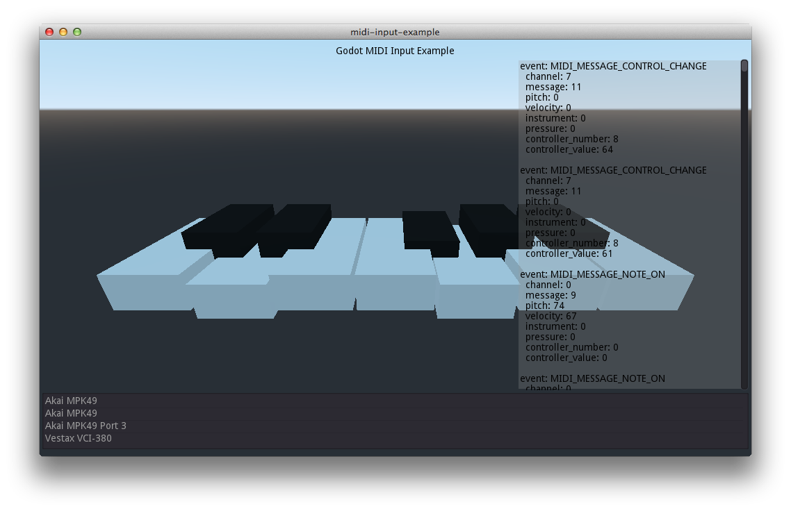

# Godot MIDI Input example

**Home:** <https://github.com/follower/godot-midi-input-example>



## The Demo

The enclosed Godot 3.1-compatible project lists available MIDI input devices, dumps textual information about the events received and visualises key presses on a 1-octave on screen keyboard.

## Just The Code...

If you just want some example code so you can implement your own MIDI Input-based Godot project...

```gdscript

# The MIDI Input specific parts...

func _ready():
	OS.open_midi_inputs() # Required for cross-platform reliability.

	print(OS.get_connected_midi_inputs()) # List available MIDI input sources (e.g. keyboard, controller).


func _unhandled_input(event : InputEvent):

	if (event is InputEventMIDI): # When we get a MIDI input event...

		var event_dump_rb : String = ""

		# Display the available property values...
		event_dump_rb += "chn: {channel} msg: {message}\n".format({"channel": event.channel, "message": event.message})
		event_dump_rb += "  pitch: {pitch} vel: {velocity}\n".format({"pitch": event.pitch, "velocity": event.velocity})

		event_dump_rb += "\n"

		print(event_dump_rb)


		# Example of converting pitch to a keyboard key (not a musical key) within an octave.
		var key_index = event.pitch % 12


		# Handle the received message type appropriately...
		match event.message:
			MIDI_MESSAGE_NOTE_ON:
				# Do something here...

			MIDI_MESSAGE_NOTE_OFF:
				# Do something here...

```

*Brought to you by follower at <http://rancidbacon.com/>.*
